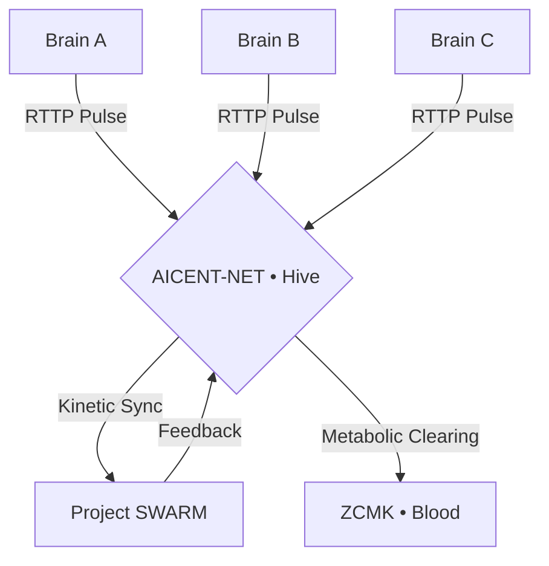

# 🟣 aicent-net: The Hive

**Global Operational Grid & Collective Intelligence Protocol [RFC-006]**

[](https://github.com/Aicent-Stack/manifesto/blob/main/rfcs/RFC-006-AICENT-NET.md)
[](#)
[](http://aicent.net)

> *"An individual is a reflex; a hive is a civilization. Aicent-Net is the backbone of the collective mind."*

`aicent-net` is the operational layer of the **Aicent Stack**. It implements the **Hive-Mind Architecture**, orchestrating multiple sovereign AID entities into a unified kinetic swarm. By leveraging the heritage of carrier-grade distribution, it achieves **Kinetic Resonance** and **Collective Immunity** at a planetary scale.

---

## 🐝 The Hive Logic (RFC-006)

As defined in **[RFC-006](https://github.com/Aicent-Stack/manifesto/blob/main/rfcs/RFC-006-AICENT-NET.md)**, this layer manages the transition from individual homeostasis to group coherence:

| Feature | Technical Implementation | Goal |
| :--- | :--- | :--- |
| **Kinetic Resonance** | Phased-array temporal alignment | < 50µs Group Jitter |
| **Metabolic Balancing**| Distributed ZCMK credit clearing | Resource Homeostasis |
| **Swarm Shield** | Collective RPKI cross-attestation | Pathogen Ejection |
| **Grid Sovereignty** | Carrier-grade backbone routing | 100% Finality |

---

## 🏗️ Architectural Role

Aicent-Net acts as the **Operational Grid**. It provides the physical and logical "soil" where thousands of Aicent Brains converge.



---

## 🛠️ Current Development Status

- [x] **RFC-006 Specification Phase**
- [ ] **Kinetic Resonance Engine (Alpha)**
- [ ] **Collective RPKI Consensus Logic**
- [ ] **Planetary Scale Grid Simulation**

---

## 🚀 Quick Start (Preview)

Aicent-Net is currently in the **Evolutionary Draft** phase. Experimental modules will be released as part of the v0.3.0 cycle.

```bash
# Clone the unified workspace to include the Hive layer
git clone https://github.com/Aicent-Stack/aicent-stack.git
cd aicent-stack
cargo check -p aicent-net
```

---
© 2026 Aicent.com Organization. **SYSTEM STATUS: EVOLVING (HIVE-PHASE)**
```
